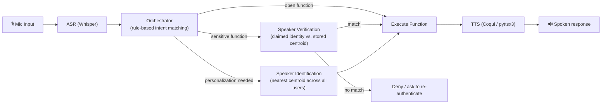
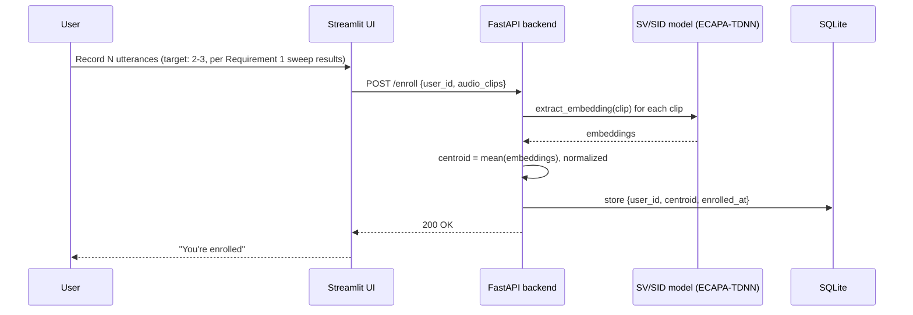

# Secure Virtual Assistant — Architecture & Integration Guide

This document covers Requirement 2: how the trained speaker model plugs into a complete assistant pipeline (ASR → orchestrator → SV/SID → TTS), the chosen tech stack and why, the enrollment flow, and the repo layout.

## 1. Tech Stack

| Component | Choice | Why |
|---|---|---|
| ASR | **Whisper** (`faster-whisper`, `small`/`base` model) | Runs fully locally, no API cost, handles varied accents/mic quality well, `faster-whisper` gives CPU-friendly inference speed without needing a GPU at inference time. |
| Speaker embedding (SV/SID) | **ECAPA-TDNN**, pretrained (`speechbrain/spkrec-ecapa-voxceleb`) | Chosen over the from-scratch model per the Requirement 1 report — 0.90% EER vs. 11.78%, no additional training cost. |
| Orchestrator | **Rule-based intent matching** | Fast to build and debug, deterministic (important for a verification-gated demo — you want predictable behavior, not LLM variance), no training/data requirement. Straightforward to extend to Intent+Entity or LLM-based later if time allows. |
| TTS | **Coqui TTS** (primary), **pyttsx3** (offline fallback) | Coqui gives consistent, decent-quality neural speech across platforms with a pure-Python API. pyttsx3 is kept as a zero-download, fully offline fallback (uses the OS's built-in speech engine) in case Coqui setup is a blocker on demo day. `gTTS` was considered but dropped — it requires a live internet connection and is rate-limited, which is a bad dependency for a live grading demo. |
| Backend | **FastAPI** + **Uvicorn** | Native async support (useful once ASR/TTS calls are in the request path), automatic OpenAPI docs (useful for the two of you dividing work), Pydantic request/response validation catches integration bugs early. |
| Enrollment / interaction UI | **Streamlit** | Fastest path to a working "web interface" for enrollment and management with a two-person team on a one-month timeline — built-in audio recording widgets, no separate frontend build needed. Talks to the FastAPI backend over HTTP. |
| Embedding / user storage | **SQLite** (via `sqlite3` or `SQLAlchemy`) | Zero setup, file-based, sufficient for a course-project number of enrolled users; stores each user's centroid embedding as a serialized vector. |

## 2. System Architecture



**Where SV vs. SID applies:**
- **Verification (SV)** answers *"is this really the user they claim to be?"* — a 1-to-1 check against one stored centroid. Used to gate sensitive functions.
- **Identification (SID)** answers *"who is speaking, out of all enrolled users?"* — a 1-to-N nearest-centroid lookup. Used to personalize open functions without requiring the user to state who they are.

Both reuse the same embedding extraction call (`extract_embedding(audio) -> 192-dim vector`) from Requirement 1 — SV and SID differ only in the comparison step afterward (one centroid vs. all centroids), not in the model.

## 3. Enrollment Flow



Per the Requirement 1 identification sweep, **2-3 enrollment utterances** already put the pretrained model near its accuracy ceiling (~99%), so the enrollment UI should request that many by default rather than over-asking users for more recordings than the model actually benefits from.

## 4. Runtime Flow (per user turn)

1. **Capture** — Streamlit UI records a short audio clip from the mic.
2. **ASR** — Whisper transcribes it to text.
3. **Orchestrator** — matches the transcript against a set of rule-based command patterns, returning an intent + whether it's `open` / `gated` / `personalized`.
4. **Branch**:
   - `open` → run the function directly.
   - `gated` → run SV: extract embedding from this turn's audio, compare (cosine similarity) against the claimed user's stored centroid, accept/reject against the EER-derived threshold from Requirement 1 (re-tuned on live mic audio if needed — see the report's Future Work).
   - `personalized` → run SID: extract embedding, compare against **all** stored centroids, take the nearest match, use that identity's data/preferences in the response.
5. **Execute** the corresponding function (weather lookup, calendar read, music preference, etc.).
6. **TTS** — synthesize the response and play it back.

## 5. Use Cases (minimum 3, per requirement)

| Function | Type | Behavior |
|---|---|---|
| "What's the weather?" | Open | No authentication; answers for anyone. |
| "Read my last message" / "unlock my calendar" | Gated (SV) | Requires the speaker to verify as the claimed account owner before the action runs. |
| "Play my music" / "what's on my schedule" | Personalized (SID) | Identifies which enrolled user is speaking (no explicit login) and tailors the response to that person. |

## 6. Repository Structure

```
secure-virtual-assistant/
├── README.md                     # this file
├── REPORT_README.md              # Requirement 1 report (dataset/model/training/eval)
├── requirements.txt
├── models/
│   ├── sv_sid.py                 # wraps the pretrained ECAPA-TDNN, extract_embedding(), verify(), identify()
│   └── checkpoints/               # (optional) from-scratch checkpoint, kept for report reproducibility only
├── backend/
│   ├── main.py                   # FastAPI app
│   ├── routes/
│   │   ├── enroll.py              # POST /enroll
│   │   ├── verify.py              # POST /verify
│   │   ├── identify.py            # POST /identify
│   │   └── command.py             # POST /command  (full turn: ASR -> orchestrator -> SV/SID -> TTS)
│   ├── orchestrator.py           # rule-based intent matching + function dispatch
│   ├── asr.py                    # Whisper wrapper
│   ├── tts.py                    # Coqui/pyttsx3 wrapper
│   └── db.py                     # SQLite models (users, centroids)
├── frontend/
│   └── app.py                    # Streamlit UI: enrollment + live interaction
└── notebooks/
    ├── week1_ecapa_baseline.ipynb
    ├── week2a_train_from_scratch.ipynb
    └── week2b_evaluate.ipynb
```

## 7. API Endpoints

| Method | Path | Purpose |
|---|---|---|
| `POST` | `/enroll` | Accepts `user_id` + N audio clips, stores the resulting centroid embedding. |
| `POST` | `/verify` | Accepts `claimed_user_id` + one audio clip, returns accept/reject. |
| `POST` | `/identify` | Accepts one audio clip, returns the best-matching `user_id` (or "unknown" if below threshold). |
| `POST` | `/command` | Full pipeline entry point: audio in → ASR → orchestrator → SV/SID (if needed) → function execution → TTS audio out. |

## 8. Data Storage

Each enrolled user is stored as:

```json
{
  "user_id": "alice",
  "centroid": [0.0123, -0.0456, ...],   // 192-dim, L2-normalized
  "enrolled_at": "2026-08-09T10:00:00Z",
  "n_enrollment_clips": 3
}
```

Only the embedding is stored for matching — raw enrollment audio can optionally be kept separately (e.g. for re-enrollment or debugging) but isn't required for the app to function. Flag this in the report's enrollment-procedure section: storing embeddings rather than raw audio is a reasonable privacy-minded default, since embeddings aren't trivially invertible back to intelligible speech.

## 9. Setup

```bash
pip install fastapi uvicorn streamlit speechbrain faster-whisper TTS pyttsx3 sqlalchemy
```

```bash
# terminal 1 — backend
uvicorn backend.main:app --reload --port 8000

# terminal 2 — frontend
streamlit run frontend/app.py
```

## 10. Open Questions to Settle Before Building

- **Verification audio**: same command utterance used for SV, or a fixed enrollment-style phrase spoken separately before the command? (Flagged earlier — affects both orchestrator design and expected accuracy; short, varied commands are harder to verify reliably than a consistent phrase.)
- **Rejection UX**: what happens when SV fails — one retry, then deny? Silent deny vs. explicit "I couldn't verify you"?
- **Threshold source**: start from the EER threshold computed in the Requirement 1 notebooks, but plan to re-tune it once you have real microphone recordings from enrollment testing (dataset audio is cleaner than a laptop mic in a normal room).
