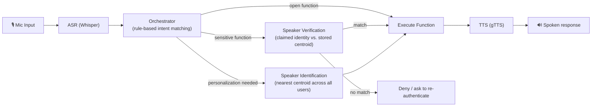
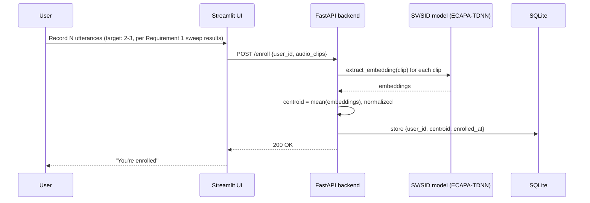

# Secure Virtual Assistant — Architecture & Integration Guide

This document covers Requirement 2: how the trained speaker model plugs into a complete assistant pipeline (ASR → orchestrator → SV/SID → TTS), the chosen tech stack and why, the enrollment flow, and the repo layout.

## 0. Current Status

- **Implemented** (`src/`): config, SQLite storage, ASR (faster-whisper), speaker verification/identification (ECAPA-TDNN via speechbrain), rule-based orchestrator, example use-case functions, TTS (gTTS), and a `Pipeline` class wiring all of it into the full per-turn runtime flow.
- **Not yet implemented**: `app/backend` (FastAPI), `app/frontend` (Streamlit). The pipeline is callable directly from Python today (see `tests/test_core.py`) and is designed so the FastAPI layer will be a thin wrapper around `Pipeline.process_command()` / `Pipeline.enroll_user()` with no changes needed underneath.
- **Testing**: `tests/test_core.py` is a manual integration-test script (not pytest) that enrolls a user and runs sample commands through all three intent types against real audio. See section 10.

## 1. Tech Stack

| Component | Choice | Why |
|---|---|---|
| ASR | **Whisper** (`faster-whisper`, `small`/`base` model) | Runs fully locally, no API cost, handles varied accents/mic quality well, `faster-whisper` gives CPU-friendly inference speed without needing a GPU at inference time. |
| Speaker embedding (SV/SID) | **ECAPA-TDNN**, pretrained (`speechbrain/spkrec-ecapa-voxceleb`) | Chosen over the from-scratch model per the Requirement 1 report — 0.90% EER vs. 11.78%, no additional training cost. |
| Orchestrator | **Rule-based intent matching** | Fast to build and debug, deterministic (important for a verification-gated demo — you want predictable behavior, not LLM variance), no training/data requirement. Straightforward to extend to Intent+Entity or LLM-based later if time allows. |
| TTS | **gTTS** (primary) | it requires a live internet connection. Later will expand to a local model |
| Backend | **FastAPI** + **Uvicorn** | Native async support (useful once ASR/TTS calls are in the request path), automatic OpenAPI docs (useful for the two of you dividing work), Pydantic request/response validation catches integration bugs early. |
| Enrollment / interaction UI | **Streamlit** | Fastest path to a working "web interface" for enrollment and management with a two-person team on a one-month timeline — built-in audio recording widgets, no separate frontend build needed. Talks to the FastAPI backend over HTTP. |
| Embedding / user storage | **SQLite** (via `sqlite3`) | Zero setup, file-based, sufficient for a course-project number of enrolled users; stores each user's centroid embedding as a serialized vector. |

## 2. System Architecture



**Where SV vs. SID applies:**
- **Verification (SV)** answers *"is this really the user they claim to be?"* — a 1-to-1 check against one stored centroid. Used to gate sensitive functions.
- **Identification (SID)** answers *"who is speaking, out of all enrolled users?"* — a 1-to-N nearest-centroid lookup. Used to personalize open functions without requiring the user to state who they are.

Both reuse the same embedding extraction call (`SpeakerModel.extract_embedding(audio) -> 192-dim vector`, in `src/speaker.py`) — SV and SID differ only in the comparison step afterward (one centroid vs. all centroids), not in the model.

## 3. Enrollment Flow



Per the Requirement 1 identification sweep, **2-3 enrollment utterances** already put the pretrained model near its accuracy ceiling (~99%), so the enrollment UI should request that many by default rather than over-asking users for more recordings than the model actually benefits from.

Implemented today as `SpeakerModel.enroll(user_id, audio_paths)` in `src/speaker.py`, which extracts one embedding per clip, averages + L2-normalizes them into a centroid, and persists it via `src/db.py`. The FastAPI `/enroll` endpoint (not yet built) will just call this directly.

## 4. Runtime Flow (per user turn)

1. **Capture** — Streamlit UI records a short audio clip from the mic.
2. **ASR** — Whisper transcribes it to text.
3. **Orchestrator** — matches the transcript against a set of rule-based command patterns, returning an intent + whether it's `open` / `gated` / `personalized`.
4. **Branch**:
   - `open` → run the function directly.
   - `gated` → run SV: extract embedding from this turn's audio, compare (cosine similarity) against the claimed user's stored centroid, accept/reject against the EER-derived threshold from Requirement 1 (re-tuned on live mic audio if needed — see the report's Future Work).
   - `personalized` → run SID: extract embedding, compare against **all** stored centroids, take the nearest match, use that identity's data/preferences in the response.
5. **Execute** the corresponding function (weather lookup, calendar read, music preference, etc.).
6. **TTS** — synthesize the response and play it back.

Implemented today as `Pipeline.process_command(audio_path, claimed_user_id=None)` in `src/pipeline.py`, which runs steps 2–6 end-to-end and returns a `CommandResult` (transcript, resolved intent, auth outcome, response text, and path to the synthesized reply audio). Step 1 (mic capture via Streamlit) is not yet built — for now, `process_command` takes a path to an already-recorded `.wav` file, which is how `tests/test_core.py` drives it.

**Current design choice on the "same command vs. fixed phrase" open question (README section 9):** the same command utterance is used for SV — `claimed_user_id` is passed alongside the command audio rather than requiring a separate enrollment-style phrase beforehand. Revisit this if verification accuracy on short/varied commands turns out too unreliable once tested on live mic audio.

## 5. Use Cases (minimum 3, per requirement)

| Function | Type | Behavior |
|---|---|---|
| "What's the weather?" | Open | No authentication; answers for anyone. |
| "Read my last message" / "unlock my calendar" | Gated (SV) | Requires the speaker to verify as the claimed account owner before the action runs. |
| "Play my music" / "what's on my schedule" | Personalized (SID) | Identifies which enrolled user is speaking (no explicit login) and tailors the response to that person. |

Implemented as stub handlers in `src/functions.py` (`get_weather`, `get_time`, `read_last_message`, `unlock_calendar`, `play_my_music`, `my_schedule`), registered in `FUNCTION_REGISTRY` and dispatched by `Pipeline`. Vietnamese command keywords for matching each one live in `src/orchestrator.py`.

## 6. Repository Structure

```
secure-virtual-assistant/
├── README.md                     # this file
├── report.md                     # Requirement 1 report (dataset/model/training/eval)
├── requirements.txt
├── data/                          # models checkpoints, database, tempfiles, outputs, etc.
│   ├── tts_out/                   # synthesized reply audio (gTTS output)
│   ├── pretrained_models/         # speechbrain ECAPA-TDNN checkpoint (auto-downloaded)
│   └── assistant.db               # SQLite: enrolled users' centroids
├── app/
│   ├── backend/                   # FastAPI app (not yet built)
│   └── frontend/                  # Streamlit UI (not yet built)
├── src/                           # core modules — implemented
│   ├── config.py                  # central settings
│   ├── db.py                      # SQLite storage for user centroids
│   ├── asr.py                     # faster-whisper wrapper
│   ├── speaker.py                 # embedding, enroll, verify (SV), identify (SID)
│   ├── orchestrator.py            # rule-based intent matching
│   ├── functions.py               # use-case function implementations
│   ├── tts.py                     # TTS interface + gTTS engine
│   └── pipeline.py                # wires src/* into the full per-turn flow
├── tests/
│   └── test_core.py               # manual integration test for src/ (no web layer needed)
└── notebooks/                     # train, finetune, evaluate, etc. notebooks
```

## 7. API Endpoints

| Method | Path | Purpose |
|---|---|---|
| `POST` | `/enroll` | Accepts `user_id` + N audio clips, stores the resulting centroid embedding. |
| `POST` | `/verify` | Accepts `claimed_user_id` + one audio clip, returns accept/reject. |
| `POST` | `/identify` | Accepts one audio clip, returns the best-matching `user_id` (or "unknown" if below threshold). |
| `POST` | `/command` | Full pipeline entry point: audio in → ASR → orchestrator → SV/SID (if needed) → function execution → TTS audio out. |

Not yet built. Each of these will be a thin FastAPI wrapper: `/enroll` → `Pipeline.enroll_user`, `/command` → `Pipeline.process_command`. `/verify` and `/identify` as standalone endpoints will call `SpeakerModel.verify` / `.identify` directly for cases where the frontend wants an auth check without also running a full command.

## 8. Data Storage

Each enrolled user is stored as:

```json
{
  "user_id": "alice",
  "centroid": [0.0123, -0.0456, ...],   // 192-dim, L2-normalized
  "enrolled_at": "2026-08-09T10:00:00Z",
  "n_enrollment_clips": 3
}
```

Only the embedding is stored for matching — raw enrollment audio can optionally be kept separately (e.g. for re-enrollment or debugging) but isn't required for the app to function. Flag this in the report's enrollment-procedure section: storing embeddings rather than raw audio is a reasonable privacy-minded default, since embeddings aren't trivially invertible back to intelligible speech.

Implemented in `src/db.py` as a single SQLite `users` table (`user_id`, `centroid` as JSON text, `enrolled_at`, `n_enrollment_clips`), with a plain upsert on re-enrollment (no history of previous centroids is kept).

## 9. Open Questions to Settle Before Building

- **Verification audio**: same command utterance used for SV, or a fixed enrollment-style phrase spoken separately before the command? **Resolved for now**: same-utterance (see section 4) — revisit after live-mic testing.
- **Rejection UX**: what happens when SV fails — one retry, then deny? Silent deny vs. explicit "I couldn't verify you"? **Resolved for now**: single attempt, explicit spoken denial (`Pipeline._deny` in `src/pipeline.py`). No retry loop yet.
- **Threshold source**: start from the EER threshold computed in the Requirement 1 notebooks, but plan to re-tune it once you have real microphone recordings from enrollment testing (dataset audio is cleaner than a laptop mic in a normal room). **Currently a placeholder** (`settings.spk_verify_threshold = 0.50` in `src/config.py`) — replace with the actual Requirement 1 value before evaluating accuracy.

## 10. Testing the Core Modules

Before the FastAPI/Streamlit layer exists, `tests/test_core.py` exercises the full pipeline directly against real audio files. It is a manual/integration script, not a pytest suite — the interesting failure modes here (ASR accuracy, embedding similarity, threshold behavior) only show up against real models and audio, not mocks.

**Setup:**
```bash
# Create conda env, then install ffmpeg first because it may confict with
# existing packages when installed later. Avoid using later versions in
# which python>3.12 were used.
conda install -c conda-forge ffmpeg==5.1.2
ffmpeg -version     # Check installation, hope it does not broke :(((

# To use SpeechBrain, support python>=3.9;<=3.12
conda install python=3.11
python --version
pip --version       # Hope nothing broke :(((

# Other
pip install -r requirements.txt
pip check           # Hope nothing broke :(((

# Install k2 (for SpeechBrain) using torch version that match our requirements.txt
# Link: https://k2-fsa.github.io/k2/index.html
pip install k2==1.24.4.dev20260625+cpu.torch2.4.1 -f https://k2-fsa.github.io/k2/cpu.html

# Tips: To avoid broken environment, gradually picking a working version
#       of the most important module (e.g. ffmpeg, speechbrain, torch,
#       etc.), then try different versions of the least important ones.
```

**1. Enroll a test user** (2–3 clips recommended, per section 3):
```bash
python -m tests.test_core --enroll data/samples/alice_1.wav data/samples/alice_2.wav --user alice
python -m tests.test_core --enroll data/samples/bob_1.wav data/samples/bob_2.wav --user bob
```

Transcripts for the enrollment and test audio.
```text
enroll1:
    Bí mật của thiên tài là có được tinh thần của trẻ con khi mình đã lớn,
    có nghĩa là không bao giờ mất nhiệt huyết.

enroll2:
    Đức Chúa phán như sau: Hãy tuân giữ điều chính trực,
    thực hành điều công minh, vì ơn cứu độ của Ta đã gần tới,
    và đức công chính của Ta sắp được biểu lộ.

open_weather:
    Cho tôi biết thời tiết hôm nay

gated_message:
    Xem tin nhắn mới nhất của tôi

personal_music:
    Hãy mở nhạc của tôi
```

**2. Run the full sample-command test:**
```bash
python -m tests.test_core --run
```

This runs one command through each branch of the pipeline — open, gated (correct claimed identity), gated (wrong claimed identity, expected to be denied), personalized, and an unrecognized transcript — and prints the transcript, matched intent, auth outcome, response text, and path to the synthesized reply audio for each, so results can be checked by eye and by ear.

Before running, edit the `SAMPLES` dict at the top of `tests/test_core.py` to point at real `.wav` files on your machine (Requirement 1 dataset clips work, or anything recorded ad hoc). `ENROLLED_USER_FOR_TEST` must match the `--user` value used in the enroll step for the gated/personalized checks to be meaningful.

You can take a look at a succesful test.

```text
Enrolled users: ['alice', 'bob']

--- OPEN command ---
  transcript      : 'cho tôi biết thời tiết hôm nay'
  intent          : get_weather (open)
  auth_passed     : True
  resolved_user_id: None
  response_text   : 'Hôm nay trời nắng nhẹ, nhiệt độ khoảng hai mươi tám độ.'
  audio_out       : data\tts_out\gtts_1786992324224.mp3

--- GATED command (claimed_user_id=alice) ---
  transcript      : 'Xem tin nhắn mới nhất của tôi'
  intent          : read_last_message (gated)
  auth_passed     : True
  resolved_user_id: alice
  response_text   : 'Đây là tin nhắn gần nhất của alice: (nội dung tin nhắn mẫu).'
  audio_out       : data\tts_out\gtts_1786992332893.mp3

  transcript      : 'Xem tin nhắn mới nhất của tôi'
  intent          : read_last_message (gated)
  auth_passed     : False
  resolved_user_id: None
  response_text   : 'Tôi không thể xác minh giọng nói của bạn.'
  audio_out       : data\tts_out\gtts_1786992341098.mp3

--- PERSONALIZED command ---
  transcript      : 'Hãy mở nhạc của tôi'
  intent          : play_my_music (personalized)
  auth_passed     : True
  resolved_user_id: alice
  response_text   : 'Đang phát danh sách nhạc yêu thích của alice.'
  audio_out       : data\tts_out\gtts_1786992349052.mp3

--- UNKNOWN command ---
  transcript      : 'Cả hai bên hãy cố gắng hiểu cho nhau.'
  intent          : unknown (none)
  auth_passed     : False
  resolved_user_id: None
  response_text   : 'Xin lỗi, tôi không hiểu yêu cầu của bạn.'
  audio_out       : None

All checks passed (see printed results above for auth correctness).
```
