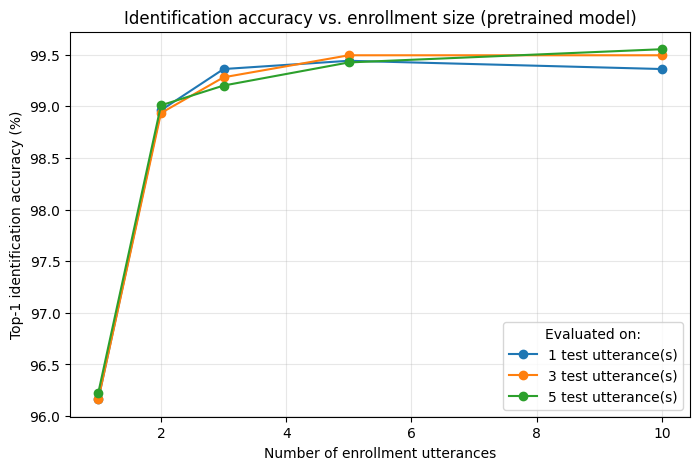
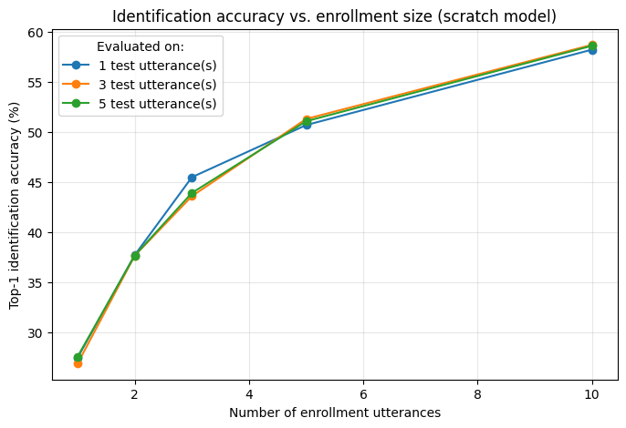

# Speaker Verification & Identification Model — Report

This document covers Requirement 1 of the project: model selection, dataset, training procedure, evaluation protocol, and experimental results for the speaker verification (SV) and speaker identification (SID) component that powers the virtual assistant.

## 1. Overview

We use **ECAPA-TDNN** as the speaker embedding model for both verification and identification. Two variants were trained and evaluated so that their results could be directly compared:

1. **Pretrained baseline** — `speechbrain/spkrec-ecapa-voxceleb`, an ECAPA-TDNN trained on the full VoxCeleb1+2 corpus (~1.2M utterances, 7,205 speakers), used off-the-shelf with no further training.
2. **Trained from scratch** — an ECAPA-TDNN of the same architecture family, randomly initialized and trained only on a 100-speaker subset of VoxCeleb1, under free-tier Kaggle GPU constraints.

Both models produce a 192-dimensional speaker embedding from a raw utterance. Verification and identification are both implemented as embedding comparisons (cosine similarity) rather than as separate models — the same embedding extractor serves both tasks.

## 2. Dataset

**VoxCeleb1** was used throughout, via two Kaggle-hosted sources:
- `sabahesaraki/voxceleb-1-dataset` — the official protocol/list files: `veri_test2.txt` (verification trial pairs) and `iden_split.txt` (identification train/val/test split).
- `kryakrya` mirror — the audio itself, split into:
  - **Dev set**: 1,211 speaker folders (used for training and as the enrollment pool for identification)
  - **Test set**: 40 speaker folders (held out; used only for verification trial pairs)

### 2.1 Verification split
`veri_test2.txt` defines ~37,720 trial pairs, each labeled same-speaker (1) or different-speaker (0), drawn exclusively from the 40 held-out test speakers. Neither model was trained on any of these 40 identities, so this is a genuine generalization test for both.

### 2.2 Identification split
`iden_split.txt` covers all 1,251 VoxCeleb1 speakers (the 1,211 dev + 40 test identities combined) with a per-utterance split label: 1 = train, 2 = val, 3 = test. We use split-1 utterances to build a per-speaker **enrollment centroid** (mean embedding) and split-3 utterances as the queries to classify — nearest-centroid by cosine similarity. This mirrors exactly how the live assistant enrolls and later recognizes a user.

### 2.3 Training subset (from-scratch model only)
A random sample of 100 speakers was drawn from the 1,211 dev-set speakers (seed=42), with all their utterances used for training (2 utterances per speaker held out as a validation slice for monitoring convergence, not used for the final evaluation above).

## 3. Model

**Architecture**: ECAPA-TDNN (Emphasized Channel Attention, Propagation and Aggregation — TDNN), implemented via SpeechBrain.

| | Pretrained baseline | From-scratch model |
|---|---|---|
| Channels | [1024, 1024, 1024, 1024, 3072] | [512, 512, 512, 512, 1536] |
| Kernel sizes | [5, 3, 3, 3, 1] | [5, 3, 3, 3, 1] |
| Dilations | [1, 2, 3, 4, 1] | [1, 2, 3, 4, 1] |
| Attention channels | 128 | 128 |
| Embedding dim | 192 | 192 |
| Input features | 80-dim log-mel filterbank | 80-dim log-mel filterbank |
| Training data | VoxCeleb1+2 (~1.2M utt., 7,205 spk.) | VoxCeleb1 subset (100 spk.) |

The from-scratch model uses a narrower channel width (512 vs. 1024) specifically to keep training tractable on free-tier Kaggle compute (T4/P100, ~30 GPU-hours/week, 12-hour session limit) — full-scale ECAPA-TDNN training on the complete VoxCeleb corpus is reported to take on the order of 100+ GPU-hours on a single V100, which is out of reach for this project's compute budget.

## 4. Training Procedure

### 4.1 Pretrained baseline
No training was performed — the model is used exactly as published, to establish an upper-bound reference for what large-scale pretraining achieves.

### 4.2 From-scratch model
- **Loss**: AAM-Softmax (Additive Angular Margin Softmax), margin = 0.2, scale = 30 — the standard loss for training discriminative speaker embeddings, applied on top of a linear classification head over the 100 training identities.
- **Optimizer**: Adam, initial learning rate 1e-3, with a OneCycleLR schedule across all training steps.
- **Batch size**: 32
- **Input**: random 3-second crops per utterance (utterances shorter than 3s are looped to fill the window), converted to 80-dim log-mel filterbank features with per-utterance mean normalization.
- **Epochs**: 30
- **Data**: ~100 speakers × ~113 utterances/speaker on average (2 held out per speaker for validation monitoring)
- **Checkpointing**: saved after every epoch to guard against Kaggle session interruptions; final checkpoint + architecture config saved for reproducible evaluation.

## 5. Evaluation Protocol

### 5.1 Speaker Verification
- **Metric**: Equal Error Rate (EER) and minimum Detection Cost Function (minDCF, p_target = 0.05, C_miss = C_fa = 1).
- **Method**: cosine similarity between the embeddings of each trial pair in `veri_test2.txt`; EER is the operating point where false-accept rate equals false-reject rate.

### 5.2 Speaker Identification
- **Metric**: Top-1 identification accuracy.
- **Method**: nearest-centroid classification (cosine similarity) between a query embedding and each enrolled speaker's centroid embedding.
- **Sweep**: repeated for every combination of enrollment size (`n_enroll` ∈ {1, 2, 3, 5, 10} utterances) and test-query count (`n_test` ∈ {1, 3, 5} utterances) to characterize how enrollment size affects real-world identification reliability — directly informing how many utterances the app should request during user enrollment.

## 6. Results

### 6.1 Speaker Verification

| Model | EER | minDCF (p=0.05) |
|---|---|---|
| Pretrained baseline | **0.90%** | **0.0694** |
| Trained from scratch (100 spk.) | 11.78% | 0.5955 |

The pretrained model's EER is consistent with published VoxCeleb benchmarks for ECAPA-TDNN. The from-scratch model's EER is roughly 13x higher — expected, given it saw ~120x fewer speaker identities and ~100x fewer utterances during training, with no large-scale pretraining to fall back on.

### 6.2 Speaker Identification — enrollment size sweep

Top-1 accuracy range across the full sweep:

| Model | Accuracy range |
|---|---|
| Pretrained baseline | 96.2% – 99.6% |
| Trained from scratch | 26.9% – 58.7% |

**Pretrained model**: accuracy is already high (~96%) with just 1 enrollment utterance, jumps to ~99% at 2 utterances, and plateaus around 99.4–99.6% from 5 utterances onward. The number of test-time utterances (1 vs. 3 vs. 5) has negligible effect — the three curves are nearly indistinguishable. **Practical implication**: 2–3 enrollment utterances are sufficient for reliable identification with this model; asking users for more brings marginal benefit.

**From-scratch model**: accuracy rises much more gradually and near-linearly, from ~27% at 1 enrollment utterance to ~58–59% at 10, with no clear plateau — more enrollment data would likely continue to help. As with the pretrained model, the number of test-time utterances has little effect on accuracy. **Practical implication**: this model's embeddings are meaningfully less discriminative per utterance; it would need either more enrollment utterances than the pretrained model or, more effectively, more training data/scale to reach comparable reliability.

## 7. Discussion

The ~13x gap in EER and the large gap in identification accuracy directly reflect the difference in training scale: ~1.2M utterances across 7,205 speakers (pretrained) vs. ~11,000 utterances across 100 speakers (from-scratch), trained under a compute budget that free-tier Kaggle GPUs can realistically support in a few hours. This comparison quantifies, for this specific architecture and task, what large-scale pretraining buys over a compute-constrained from-scratch run — and is the central experimental finding of Requirement 1.

Because the pretrained model both verifies and identifies far more reliably, and requires no additional training time or GPU budget from the team, **it is the model used to power the live assistant's verification and identification features** (Requirement 2). The from-scratch model is retained purely as the required experimental training result and comparison point.

## 8. Conclusion

- ECAPA-TDNN, used off-the-shelf via large-scale pretraining, achieves strong speaker verification (0.90% EER) and identification (96–99.6% top-1 accuracy with 2+ enrollment utterances) performance on VoxCeleb1.
- Training the same architecture from scratch on a small, compute-constrained subset (100 speakers, free-tier GPU) produces a functioning but substantially weaker model (11.78% EER, 27–59% identification accuracy), illustrating the impact of training data scale and compute budget on speaker embedding quality.
- For the enrollment procedure, 2–3 utterances are sufficient to reach near-ceiling identification accuracy with the pretrained model, informing the assistant's enrollment UX design.
- The pretrained model was selected as the production model for the assistant application due to its substantially higher reliability at no additional training cost.

## 9. Future Work

- **Fine-tune, rather than fully retrain, the pretrained model** on a small amount of team-collected enrollment-style audio, to see whether light fine-tuning closes any remaining domain gap (e.g., different microphones/rooms than VoxCeleb's source audio) without the cost of full retraining.
- **Scale up the from-scratch run** (more speakers, more epochs, data augmentation such as MUSAN noise / RIR reverberation) if additional compute becomes available, to see how much of the gap to the pretrained model can be closed under a larger but still bounded budget.
- **Threshold calibration on live microphone audio**: the EER-derived decision threshold was tuned on clean VoxCeleb recordings; real deployment audio (background noise, varying microphone quality) will likely need the verification threshold re-tuned using data collected during actual enrollment/demo sessions.
- **Cross-session robustness**: evaluate identification accuracy using enrollment and test utterances recorded in different sessions/conditions (rather than same-corpus splits), which better reflects how the assistant will actually be used day-to-day.

## 10. Kaggle Notebooks

- \[[Kaggle](https://www.kaggle.com/code/dangphamwanderer/ecapa-tdnn-on-voxceleb-from-scratch)\] Train ECAPA from scratch.
- \[[Kaggle](https://www.kaggle.com/code/dangphamwanderer/ecapa-tdnn-on-voxceleb-evaluation)\] Evaluation (support both pretrained and from-scratch models).

## Appendix: Notebooks

- `train_ecapa_scratch.ipynb` — from-scratch ECAPA-TDNN training (100 speakers).
- `eval.ipynb` — evaluation notebook (SV + SID enrollment-size sweep), supports both `pretrained` and `scratch` model types via a config flag.
