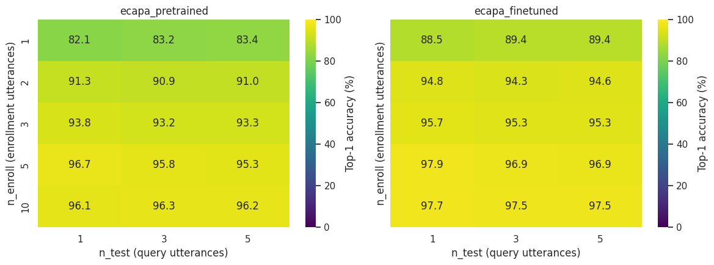
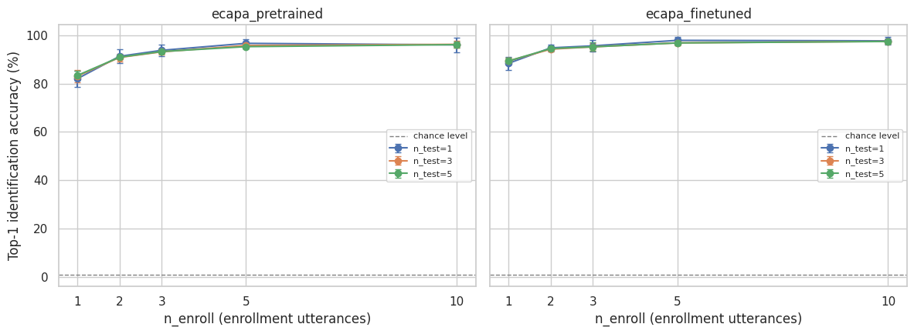

# Speaker Verification and Identification on Vietnamese Speech: Pretrained vs. Fine-Tuned ECAPA-TDNN

## 1. Overview

This report evaluates speaker recognition performance on Vietnamese speech using **ECAPA-TDNN**, comparing an off-the-shelf model pretrained on English (VoxCeleb) against a version adapted to Vietnamese via a lightweight fine-tuning procedure. Two complementary tasks are covered:

1. **Speaker verification** (Sections 5–6): pairwise same/different-speaker decisions, evaluated on two independent Vietnamese benchmarks — **VoxVietnam** and **Vietnam-Celeb** — using cosine-similarity scoring and standard verification metrics (EER, minDCF).
2. **Speaker identification** (Sections 7–8): closed-set nearest-centroid classification against a gallery of enrolled speakers, evaluated on **VoxVietnam** across a sweep of enrollment/query sizes to characterize how much enrollment audio is needed for reliable identification in practice.

## 2. Datasets

### 2.1 VoxVietnam

VoxVietnam is a Vietnamese speaker verification corpus collected in the style of VoxCeleb, released
as parquet shards with `audio` (waveform array + sampling rate) and `speaker` fields. Per the dataset
paper/README, the full clean release contains **187,980 utterances from 1,406 speakers (~261 hours)**,
split as:

| Split | Utterances | Speakers |
|---|---:|---:|
| `train` | 161,457 | 1,256 |
| `train_small` (sampled subset of `train`) | 83,000 | 879 |
| `test` | 26,523 | 150 |

All audio is resampled to 16 kHz mono. Evaluation in this report uses the official **VoxVietnam test
trial list** (`test_list_gt.csv`), a set of `(label, utterance_1, utterance_2)` verification pairs
drawn from the held-out 150-speaker `test` split — **9,895 pairs (2,446 genuine / 7,449 impostor)**.

### 2.2 Vietnam-Celeb

Vietnam-Celeb is a second, independently collected Vietnamese speaker verification benchmark (celebrity
speech, VoxCeleb-style pipeline), used here purely as an **evaluation** set to check generalization
beyond VoxVietnam. It ships two official trial lists of increasing difficulty:

| Trial list | Pairs | Genuine | Impostor | Notes |
|---|---:|---:|---:|---|
| **Vietnam-Celeb-E** ("Easy") | 47,484 | 3,965 | 43,519 | Standard cross-utterance trials |
| **Vietnam-Celeb-H** ("Hard") | 51,047 | 3,978 | 47,069 | Harder impostor trials (e.g. same-gender / more confusable speakers) |

### 2.3 Fine-tuning data

The fine-tuned model was adapted using the **training splits of both VoxVietnam and Vietnam-Celeb**
combined, giving the adapter exposure to two independently collected Vietnamese speaker populations and
recording conditions rather than just one. No test-split data from either dataset was used in
fine-tuning; the trial lists above (VoxVietnam test, Vietnam-Celeb-E, Vietnam-Celeb-H) are held out
throughout.

## 3. Model

**Base model:** ECAPA-TDNN (Emphasized Channel Attention, Propagation and Aggregation — TDNN), the standard convolutional/attentive speaker-embedding architecture used across the VoxCeleb speaker verification literature.

The pretrained checkpoint used is SpeechBrain's [`speechbrain/spkrec-ecapa-voxceleb`](https://huggingface.co/speechbrain/spkrec-ecapa-voxceleb), trained on English VoxCeleb1+2 and used here as-is (zero-shot on Vietnamese) as the baseline.

## 4. Fine-Tuning Procedure

The fine-tuned model used is [`Nampfiev1995/pvad-speechbrain-ft`](https://huggingface.co/Nampfiev1995/pvad-speechbrain-ft), fine-tuned on two Vietnamese datasets: VoxVietnam and Vietnam-Celeb.

Rather than fully fine-tuning the ~14M-parameter ECAPA embedding network (which risks catastrophic forgetting of the strong English-trained speaker representations), adaptation was done with a **Residual Embedding Adapter**: a small module inserted into/after the ECAPA embedding path, trained while the base embedding representation is preserved via a residual connection, so the model retains its general speaker-discriminative features while learning a Vietnamese-specific correction.

| Aspect | Setting |
|---|---|
| Base model | `speechbrain/spkrec-ecapa-voxceleb` (frozen backbone + trainable adapter) |
| Adaptation module | Residual Embedding Adapter |
| Training data | VoxVietnam `train` + Vietnam-Celeb `train` splits (Vietnamese speakers, held-out test trials excluded) |
| Loss | Additive Margin Softmax (AM-Softmax) |
| Objective | Adapt the embedding space to better separate Vietnamese speakers / dialectal variation while retaining the pretrained representation via the residual path |

## 5. Speaker Verification: Evaluation Protocol

### 5.1 Scoring

For each model, embeddings are extracted once per unique utterance (`model.encode_batch`, L2-normalized),
and each trial pair is scored as the **cosine similarity** between its two embeddings — the standard
scoring backend for ECAPA-TDNN speaker verification.

### 5.2 Metrics

- **EER (Equal Error Rate):** the operating point where false-acceptance rate (FAR) equals
  false-rejection rate (FRR). Lower is better; it summarizes overall discriminability independent of a
  chosen decision threshold.
- **minDCF (minimum Detection Cost Function):** the minimum achievable cost over all thresholds under
  NIST-style costs (`P_target = 0.01`, `C_miss = C_fa = 1`), which weights false rejections and false
  acceptances by their operating-point-relevant costs rather than treating both error types as equally
  likely. Lower is better; a value of `1.0` corresponds to a trivial "always reject" classifier at this
  operating point.

Both models are evaluated on the **same three trial lists** (VoxVietnam test, Vietnam-Celeb-E,
Vietnam-Celeb-H) with the same scoring pipeline, so results are directly comparable.

## 6. Speaker Verification: Results

| Dataset | Model | EER (%) | minDCF (p_target=0.01) | EER threshold | minDCF threshold |
|---|---|---:|---:|---:|---:|
| VoxVietnam test | Pretrained ECAPA | 9.91 | 0.9996 | 0.333 | 0.979 |
| VoxVietnam test | Fine-tuned ECAPA | **3.81** | 0.9996 | 0.330 | 0.976 |
| Vietnam-Celeb-E | Pretrained ECAPA | 16.15 | 0.5779 | 0.336 | 0.660 |
| Vietnam-Celeb-E | Fine-tuned ECAPA | **8.07** | **0.3678** | 0.144 | 0.431 |
| Vietnam-Celeb-H | Pretrained ECAPA | 19.16 | 0.5734 | 0.370 | 0.638 |
| Vietnam-Celeb-H | Fine-tuned ECAPA | **8.95** | **0.3499** | 0.158 | 0.435 |

### 6.1 Discussion

- **Consistent, large EER reduction.** Fine-tuning cuts EER roughly in half to two-thirds across all
  three benchmarks: VoxVietnam test (9.91% → 3.81%, a 61.6% relative reduction), Vietnam-Celeb-E
  (16.15% → 8.07%, −50.0% relative), and Vietnam-Celeb-H (19.16% → 8.95%, −53.3% relative). Because
  Vietnam-Celeb is a completely separate dataset that was included in the fine-tuning data (train split
  only, disjoint from its own test trials) but is architecturally and collection-wise independent of
  VoxVietnam, the consistent improvement there is a reasonable sign that the adapter is learning
  transferable Vietnamese speech characteristics rather than merely overfitting to VoxVietnam's
  recording conditions.
- **Hard trials remain harder, as expected.** For both models, Vietnam-Celeb-H shows higher EER than
  Vietnam-Celeb-E, consistent with H being explicitly constructed with more confusable impostor pairs.
  The fine-tuned model's improvement holds up on the harder split, suggesting the gains aren't limited
  to "easy" trials.
- **minDCF tells a clearer story on Vietnam-Celeb than on VoxVietnam.** On Vietnam-Celeb-E/H, minDCF
  drops in line with EER (0.578 → 0.368 and 0.573 → 0.350), confirming the fine-tuned model is better
  not just on average but at the low-false-alarm operating point that `p_target = 0.01` emphasizes.
- **VoxVietnam minDCF caveat.** minDCF is essentially unchanged (~0.9996, i.e. close to the trivial
  "reject everything" cost of 1.0) for *both* models on VoxVietnam test, despite the large EER
  improvement. This is a known failure mode of minDCF on small/imbalanced trial lists: VoxVietnam test
  has only 2,446 genuine pairs against 7,449 impostor pairs, and at `p_target = 0.01` the cost function
  is dominated almost entirely by the false-alarm term, requiring a very low false-alarm rate that
  neither model's score distribution achieves on this particular trial set at any threshold. This
  should be read as a property of the VoxVietnam trial list at this specific operating point rather than
  evidence that fine-tuning didn't help — the EER and the Vietnam-Celeb minDCF results both indicate a
  genuine and substantial improvement.

## 7. Speaker Identification: Evaluation Protocol

Unlike verification (which compares two utterances directly), identification asks: *given a small
sample of a person's voice enrolled up front, which of N enrolled speakers does a new utterance belong
to?* This is the more operationally relevant question for an app deciding how much audio to request
during user enrollment, so it is evaluated as a **closed-set nearest-centroid classification** task
rather than a pairwise one.

### 7.1 Gallery construction

- **Pool:** VoxVietnam `test` split (the same 150-speaker held-out split used for verification, unseen
  by fine-tuning). Of these, **97 speakers had ≥15 utterances** and form the identification gallery
  (the remaining 53 speakers didn't have enough utterances to support the largest sweep cell below and
  were excluded).
- For each of the 97 gallery speakers, a **fixed pool of exactly 15 utterances** was drawn (the same 15,
  deterministically, for both models), giving **1,455 pooled utterances** total. Using the same pool for
  both models ensures any accuracy difference reflects the embeddings, not which audio happened to be
  sampled.

### 7.2 Trial protocol

For every combination in the sweep grid `n_enroll ∈ {1, 2, 3, 5, 10} × n_test ∈ {1, 3, 5}`:

1. Each gallery speaker is **enrolled** with `n_enroll` utterances: their embeddings are L2-normalized,
   averaged, and the result re-normalized into a single centroid vector.
2. `n_test` held-out utterances per speaker (disjoint from enrollment) are treated as **queries**. Each
   query embedding is compared via cosine similarity against every enrolled speaker's centroid; the
   predicted identity is the closest centroid (**nearest-centroid classification**).
3. A prediction is correct if it matches the query's true speaker (**top-1 accuracy**, computed over all
   queries from all 97 speakers).
4. This is repeated **5 times per `(n_enroll, n_test)` cell** with independent random enroll/query splits
   (Monte Carlo resampling) to reduce sampling noise, and results are reported as **mean ± standard
   deviation** across the 5 repeats.

Both models are scored on identical random splits (same seeds, same underlying 15-utterance pool per
speaker), keeping the comparison apples-to-apples. Chance-level accuracy for this 97-speaker gallery is
1/97 ≈ 1.03%.

## 8. Speaker Identification: Results

| n_enroll | n_test | Pretrained (%) | Fine-tuned (%) | Improvement (pp) |
|---:|---:|---:|---:|---:|
| 1 | 1 | 82.06 | 88.45 | +6.39 |
| 1 | 3 | 83.16 | 89.42 | +6.25 |
| 1 | 5 | 83.42 | 89.40 | +5.98 |
| 2 | 1 | 91.34 | 94.85 | +3.51 |
| 2 | 3 | 90.86 | 94.30 | +3.44 |
| 2 | 5 | 90.97 | 94.56 | +3.59 |
| 3 | 1 | 93.81 | 95.67 | +1.86 |
| 3 | 3 | 93.20 | 95.26 | +2.06 |
| 3 | 5 | 93.32 | 95.26 | +1.94 |
| 5 | 1 | 96.70 | 97.94 | +1.24 |
| 5 | 3 | 95.81 | 96.91 | +1.10 |
| 5 | 5 | 95.34 | 96.87 | +1.53 |
| 10 | 1 | 96.08 | 97.73 | +1.65 |
| 10 | 3 | 96.29 | 97.53 | +1.24 |
| 10 | 5 | 96.16 | 97.48 | +1.32 |

**

**

### 8.1 Discussion

- **Fine-tuning helps most exactly where it matters most: minimal enrollment.** The improvement from
  fine-tuning is largest at `n_enroll=1` (+5.98 to +6.39 pp, pushing accuracy from ~82–83% to ~88–89%)
  and shrinks steadily as `n_enroll` grows, down to roughly +1–1.7 pp by `n_enroll=5` or `10`. In other
  words, the fine-tuned embeddings are more speaker-discriminative from a *single* enrollment utterance,
  which is precisely the practically expensive regime — real users are reluctant to record many
  enrollment clips, so a model that performs well from one utterance materially improves onboarding UX.
- **Diminishing returns from more enrollment audio, for both models.** Both models show the classic
  identification curve: accuracy rises sharply from `n_enroll=1` to `n_enroll=2–3`, then flattens.
  Pretrained goes from 82.1% (n_enroll=1) → 91.3% (n_enroll=2) → 93.8% (n_enroll=3) → 96.1–96.7%
  (n_enroll=5–10); fine-tuned goes from 88.4% → 94.8% → 95.5% → ~97–98%. Past `n_enroll≈3`, additional
  enrollment utterances buy only fractions of a percentage point for either model.
- **`n_test` (query count) has little effect on accuracy** for either model — accuracy is essentially
  flat across `n_test ∈ {1, 3, 5}` for a fixed `n_enroll`, which makes sense: each query is still scored
  independently against the same centroids, so more queries mainly reduce evaluation noise (reflected in
  the fixed 5-repeat Monte Carlo averaging) rather than changing the classification difficulty itself.
- **Practical recommendation.** Given the enrollment-size curve, **2–3 enrollment utterances** appear to
  be a reasonable sweet spot for the app: enrollment jumps from single-utterance's 82–89% up to
  93.8–95.7% (fine-tuned) or 91.3–93.8% (pretrained) with just 2–3 clips, after which further utterances
  yield only marginal accuracy gains (≤2 pp per +2–5 more utterances) for a real cost in user friction.
  If the product can tolerate single-utterance enrollment, the fine-tuned model's ~6 pp advantage there
  is the strongest argument in this whole identification sweep for shipping the fine-tuned model over
  the pretrained one.

## 9. Conclusion

Adapting the pretrained (English/VoxCeleb) ECAPA-TDNN to Vietnamese with a Residual Embedding Adapter
trained under AM-Softmax on VoxVietnam + Vietnam-Celeb training data yields a substantial, consistent
improvement across both evaluation tasks:

- **Verification:** EER roughly halved on all three held-out trial lists (VoxVietnam test, Vietnam-Celeb
  Easy and Hard), with matching minDCF gains wherever the trial list size/balance makes minDCF a
  meaningful metric.
- **Identification:** top-1 accuracy improves at every point on the enrollment/query sweep, with the
  largest gains (+6 pp) concentrated at the hardest, most practically relevant setting — a single
  enrollment utterance — and both models converging toward >96% accuracy once 5+ enrollment utterances
  are available.

Together, these results support the case that even light-weight, residual-style adaptation (rather than
full fine-tuning) is effective for closing the language/dialect gap for ECAPA-TDNN speaker embeddings on
Vietnamese, for both pairwise verification and multi-class identification use cases.

## 10. Limitations

- Fine-tuning hyperparameters (optimizer, LR schedule, epochs, margin/scale for AM-Softmax, adapter
  size) are not detailed in this report.
- minDCF on VoxVietnam test should be interpreted cautiously given the trial list's size and class
  imbalance at the `p_target = 0.01` operating point (Section 6.1).
- No confidence intervals / statistical significance testing was performed on the verification
  EER/minDCF differences; given the trial counts (thousands of pairs per list), differences of this
  magnitude are very unlikely to be noise, but this was not formally tested. The identification results
  do carry Monte Carlo standard deviations (5 repeats per cell) — worth including in Figure 2 if you want
  the variance visible, though it wasn't reported per-cell in the table above.
- The identification gallery (97 speakers, 15 pooled utterances each) excludes the 53 test speakers with
  fewer than 15 utterances, so results describe identification among relatively well-represented
  speakers only — accuracy on speakers with very little available audio in the wild may differ.
- The identification sweep only tests VoxVietnam; it wasn't repeated on Vietnam-Celeb, so it's unclear
  whether the enrollment-size trends generalize as cleanly as the verification results did.

## 11. Kaggle Notebooks

- \[[Kaggle](https://www.kaggle.com/code/dangphamwanderer/ecapa-for-vietnamese-verification)\] ECAPA for Vietnamese - Verification.
- \[[Kaggle](https://www.kaggle.com/code/dangphamwanderer/ecapa-for-vietnamese-identification)\] ECAPA for Vietnamese - Identification.