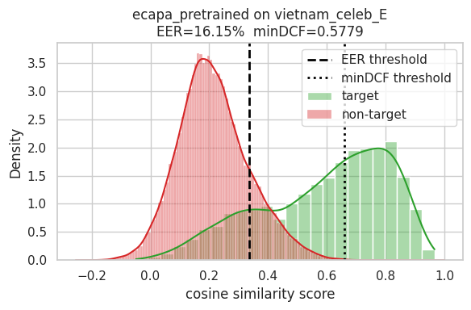
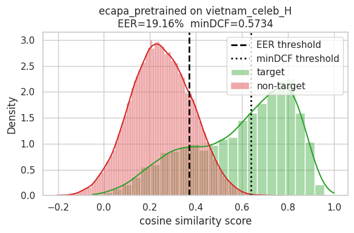
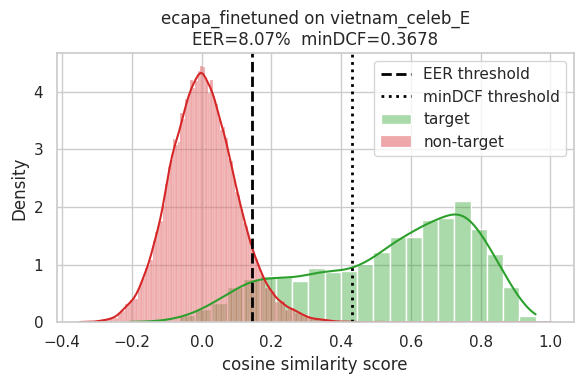
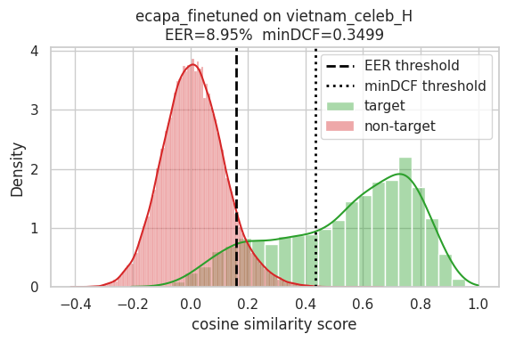

# Report

Group: ???

Members:
- Dang
- Bao

## Table of Contents

- [Datasets](#datasets)
- [Models](#models)
- [Evaluation Protocol](#evaluation-protocol)
- [Decision Threshold](#decision-threshold)
- [Enrollment Procedure](#enrollment-procedure)
- [References](#references)
- [Secure Virtual Assistant](#secure-virtual-assistant)

## Datasets

This is the Vietnam-Celeb dataset \[1\], which consists of 1,000 speakers and more than 87,000 utterances. The total duration of the dataset is 187 hours, with all utterances resampled to 16,000 Hz. Vietnam-Celeb includes gender and dialect labels for all speakers, which is crucial in building a Vietnamese speech dataset.

There are two test sets from Vietnam-Celeb, sampled 120 speakers from the data, with consideration to making sure the test data is gender-balanced and dialect-balanced. When creating the test sets, 120 speakers are chosen among the speakers who have the highest speech similarity scores and visual similarity scores.

- **Vietnam-Celeb-E**, an easy test set. Non-target (negative) trials are sampled randomly.
- **Vietnam-Celeb-H**, a hard test set. Non-target (negative) trials are created from speaker pairs in which each pair have the same gender and dialect labels.

|subset|# of spks|# of utters|# of utter pairs|
|-|-:|-:|-:|
|Vietnam-Celeb-E| 120|  4,207| 55,015|
|Vietnam-Celeb-H| 120|  4,217| 55,015|

And this is the incomplete version of the dataset from Kaggle.
- Vietnam-Celeb-E: Dropping 7,532 pairs referencing 194 missing audio files.
- Vietnam-Celeb-H: Dropping 3,969 pairs referencing 185 missing audio files.

|subset|# of spks|# of utters|# of utter pairs|
|-|-:|-:|-:|
|Vietnam-Celeb-E| 122|  4,013| 47,848|
|Vietnam-Celeb-H| 121|  4,032| 51,047|

## Models

The baseline model is ECAPA [2] trained on VoxCeleb (1 and 2), using the pretrained checkpoint from SpeechBrain's \[3\]. A comparison with the baseline is the trained model with Vietnam-Celeb, taking the result from Vietnam-Celeb paper \[1\].

We also experimented with fine-tuning the baseline model:
- For full parameter fine-tuning, we take the model result from Vietnam-Celeb paper \[1\].
    - Optimized using Additive Angular Margin (AAM-Softmax) Loss.
    - Full fine-tuning method, using the same training configurations as the trained mode with less epochs, 30 epochs.
- For parameter efficient finetuning (PEFT), we used a model from Hugging Face \[4\] that used the SpeechBrain interface.
    - Optimized using Additive Margin (AM-Softmax) loss.
    - Adapter-based method, using Residual Embedding Adapter with Vietnamese speaker datasets (such as VoxVietnam and Vietnam-Celeb).

## Evaluation Protocol

### a. Evaluation Trials

In speaker verification (SV), a trial is a test case involving an enrollment utterance and a test utterance. With modern embedding-based SV systems, both the enrollment utterance and the test utterance are represented by embedding vectors.

If the two embedding vectors are from the same speaker then the trial is ‘target’ or ‘positive’, and if they are from different speakers, the trial is ‘non-target’ or ‘negative’.

|subset|# of trials|# target trials| # non-target trials|
|-|-:|-:|-:|
|Vietnam-Celeb-E| 47,848| 3,965|  43,519|
|Vietnam-Celeb-H| 51,047| 3,978|  47,069|

### b. Speaker verification

For each model, embeddings are extracted once per utterance, and each trial pair is scored as the cosine similarity between its two embeddings. Performancewill be measured with metrics:

- **EER (Equal Error Rate):** the operating point where false-acceptance rate (FAR) equals false-rejection rate (FRR). Lower is better.
- **minDCF (minimum Detection Cost Function):** the minimum achievable cost over all thresholds under NIST-style costs ($P_{target} = 0.01$ and $C_{Miss} = C_{FA} = 1$), which weights false rejections (Miss) and false acceptances (FA) by their operating-point-relevant costs. Lower is better.

### c. Results

|Model| Easy - EER (%)| Easy - minDCF| Hard - EER (%)| Hard - minDCF|
|-|-:|-:|-:|-:|
|Vox| 16.15| 0.5779| 19.16| 0.5734|
|Vietnam-Celeb| 6.31| -| 8.62| -|
|Vox + Full fine-tuning| 7.33| -| 9.37| -|
|Vox + Adapter-based PEFT| 8.07| 0.3678| 8.95| 0.3499|

## Decision Threshold

In a speaker verification system, a speaker claims an identity and requests verification. The system captures their voice as a test utterance and retrieves the enrolled utterance(s) for the claimed identity. After computing a similarity score between the enrolled and test utterances, a **verification decision** is made: accept, reject, or request another utterance. (Without a claimed identity, this becomes an **identification decision** instead.)

### a. Hypothesis Testing

Given a match score, the binary verification decision involves choosing between two hypotheses: that the speaker is who they claim to be (**target**), or that they are not (**non-target**).

The figures below show this hypothesis-testing setup applied to Vietnam-Celeb-E and Vietnam-Celeb-H.

**Fig. 1** Distributions of target/non-target and evaluation results of pretrained ECAPA. (a) Vietnam-Celeb-E. (b) Vietnam-Celeb-H.

**Fig. 2** Distributions of target/non-target and evaluation results of finetuned ECAPA. (a) Vietnam-Celeb-E. (b) Vietnam-Celeb-H.

Once a decision threshold (e.g., the minDCF threshold) is set, a trial with a score above the threshold is **accepted** (target), and a trial with a score below it is **rejected** (non-target).
- Accepting an imposter (non-target) causes a **FAR** error (False Acceptance Rate).
- Rejecting a genuine user (target) causes a **FRR** error (False Rejection Rate).

|Model|minDCF theshold|FAR|FRR|
|-|-:|-:|-:|
|*Vietnam-Celeb-E*| | | |
|Vox| 0.660| 0.000| 0.532|
|Vox + Adapter-based PEFT| 0.431| 0.001| 0.316|
|*Vietnam-Celeb-H*| | | |
|Vox| 0.638| 0.001| 0.493|
|Vox + Adapter-based PEFT| 0.435| 0.000| 0.316|

### b. Choosing Threshold

Choosing a threshold requires balancing a fundamental trade-off:
- Security (low FAR): accepting an imposter is costly.
- Usability (low FRR): frequently rejecting a genuine user is costly.

Common ways to choose a decision threshold T:
- Use the EER or minDCF threshold.
- Fix a target FAR or FRR and solve for T (Neyman–Pearson criterion).
- Sweep T across a range and pick the operating point that gives the desired FAR/FRR ratio.

The system needs a threshold for three distinct decisions:
- Verification threshold: where to draw the line in the security/usability trade-off.
- Identification threshold: given the best-matching speaker, decide whether they're a known match (within threshold) or an unknown user.
- Enrollment threshold: decide whether an utterance is high-quality enough to keep for a speaker's enrollment.

Conclusion: we adopt the minDCF threshold for all three — verification, identification, and enrollment.

## Enrollment Procedure

Following the paper \[5\], selecting high-quality enrollment utterances is essential to the performance of a speaker recognition system.

The idea is to keep only enrolled utterances whose similarity scores fall within a chosen positive threshold. We reuse the threshold defined in the previous section (shared across verification, identification, and enrollment):
- For simplicity, the same threshold value is used across all three tasks.
- In production, a stricter threshold could be applied for verification (for stronger security) and enrollment (since enrollment happens in a controlled environment), while a looser threshold could be used for identification.

The enrollment procedure follows this ideas:
- Utterences from the speaker are submitted as the candidates, and only subset of the candidates are chosen for user enrollment (usually, 3 is enough to represent a user, more utterances might introduce more noise).
- The similarities between chosen utterances (cosine similarity of the embeddings) are the quality measurement. The system determine a threshold to make the decision (accept/reject speaker):
- A centroid is made from the chosen utterances, then similarity between centroid and all utterances are computed and compared with system threshold.

## Secure Virtual Assistant

### a. System Architecture

Technology stack
- Components
- Why choose these components

System architecture
- mic > ASR > Orchestrator > normal/personal/sensitive function > Deny/Execution > TTS > Speaker

### b. Processing Flow

Enrollment flow
- Enroll success -> Create user
- Enroll failed -> Ask re-enroll (how many times?)

Chatting flow
- Normal function -> Execute
- Personal function
    - Found user -> Execute
    - Not found -> Repeat new utterance, or deny?
- Sensitive function
    - Verified -> Execute
    - Failed -> Re-try (how many times?)

## References

Datasets
- \[1, [paper](https://www.isca-archive.org/interspeech_2023/pham23b_interspeech.html)\] Vietnam-Celeb: a large-scale dataset for Vietnamese speaker recognition.

Models
- \[2, [paper](https://arxiv.org/abs/2005.07143)\] ECAPA-TDNN: Emphasized Channel Attention, Propagation and Aggregation in TDNN Based Speaker Verification.
- \[3, [source](https://huggingface.co/speechbrain/spkrec-ecapa-voxceleb)\] Pretrained ECAPA-TDNN model from SpeechBrain - Hugging Face.
- \[4, [source](https://huggingface.co/Nampfiev1995/pvad-speechbrain-ft)\] Adapter-based PEFT ECAPA-TDNN model, loaded with SpeechBrain interface - Hugging Face.

Enrollment procedure
- \[5, [paper](https://www.semanticscholar.org/paper/Data-Centric-Optimization-of-Enrollment-Selection-Le-Ngo/090c0ccd5f8596a00a4c2c35a42d6d06844590d6)\] Data-Centric Optimization of Enrollment Selection in Speaker Identification.